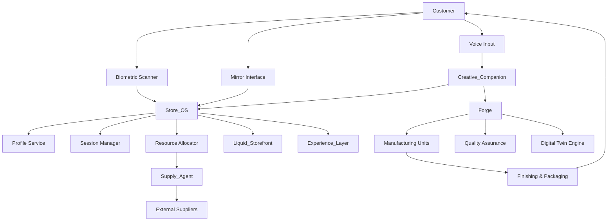

# Design Document: The Genesis Hub

## Overview

The Genesis Hub is a zero-inventory retail ecosystem that synthesizes products on-demand through the integration of six core subsystems:

1. **Store_OS**: Central orchestration layer managing all subsystems, customer sessions, and resource allocation
2. **Liquid_Storefront**: Adaptive physical environment using kinetic architecture, projection mapping, and dynamic lighting
3. **Forge**: On-demand manufacturing system combining 3D knitting, additive manufacturing, and automated finishing
4. **Creative_Companion**: Conversational AI agent for product co-creation and design refinement
5. **Supply_Agent**: Autonomous procurement system for real-time material sourcing and negotiation
6. **Experience_Layer**: Immersive content delivery system providing VR, AR, and ambient experiences during manufacturing

The system operates as a distributed, event-driven architecture where customer interactions trigger cascading workflows across subsystems. All components communicate through a message bus with guaranteed delivery semantics.

### Design Philosophy

- **Zero-inventory operation**: Products are synthesized only when ordered, eliminating traditional retail inventory
- **Hyper-personalization**: Every product is unique, generated from customer requirements and body measurements
- **Real-time adaptation**: Physical and digital environments continuously adapt to customer preferences and behavior
- **Autonomous operation**: AI agents handle design, manufacturing, and procurement with minimal human intervention
- **Graceful degradation**: System maintains core functionality even when individual components fail

## Architecture

### System Topology



### Communication Patterns

**Message Bus Architecture**: All subsystems communicate through a central message bus (Apache Kafka or similar) with the following characteristics:

- **Event sourcing**: All state changes are recorded as immutable events
- **Guaranteed delivery**: At-least-once delivery semantics with idempotent handlers
- **Topic structure**: Organized by domain (customer, manufacturing, environment, supply)
- **Schema registry**: Avro schemas for all message types with versioning support

**Key Message Topics**:
- `customer.recognized`: Customer identification and profile loading
- `customer.session.started`: New customer session initiated
- `design.parameters.updated`: Design requirements changed
- `manufacturing.job.queued`: Manufacturing job submitted
- `manufacturing.progress`: Real-time manufacturing status updates
- `environment.adaptation.requested`: Liquid_Storefront changes needed
- `supply.material.requested`: Material procurement initiated
- `experience.content.started`: Immersive content delivery begun

### Data Flow

1. **Customer Entry**: Biometric scan → Profile loading → Session creation → Environment adaptation
2. **Product Design**: Voice/gesture input → Intent parsing → Design generation → Digital Twin visualization → Approval
3. **Manufacturing**: Job queuing → Material verification → Fabrication → Quality inspection → Finishing → Packaging
4. **Supply Chain**: Material check → Supplier query → Negotiation → Delivery coordination → Inventory update


## Components and Interfaces

### Store_OS (Central Orchestrator)

**Responsibilities**:
- Customer session lifecycle management
- Resource allocation across Forge manufacturing units
- Multi-customer orchestration and conflict resolution
- System health monitoring and failover coordination
- Privacy and security enforcement

**Core Interfaces**:

```typescript
interface StoreOS {
  // Session Management
  recognizeCustomer(biometricData: BiometricSignature): Promise<CustomerSession>
  loadProfile(customerId: string): Promise<CustomerProfile>
  createAnonymousSession(): CustomerSession
  
  // Resource Allocation
  allocateForgeUnit(job: ManufacturingJob): Promise<ForgeUnit>
  getWaitTimeEstimate(): Duration
  rebalanceResources(): void
  
  // Environment Orchestration
  adaptEnvironment(customerId: string, preferences: Preferences): void
  createZonedEnvironment(customers: CustomerSession[]): EnvironmentZones
  
  // Security & Privacy
  encryptBiometricData(data: BiometricSignature): EncryptedData
  deleteCustomerData(customerId: string): Promise<void>
  checkConsent(customerId: string, dataType: DataType): boolean
}

interface CustomerSession {
  sessionId: string
  customerId: string | null  // null for anonymous
  profile: CustomerProfile | null
  startTime: Timestamp
  currentZone: string
  assignedForgeUnit: string | null
  manufacturingJob: ManufacturingJob | null
}

interface CustomerProfile {
  customerId: string
  preferences: Preferences
  bodyMeasurements: BodyMeasurements
  purchaseHistory: Purchase[]
  digitalTwinId: string | null
  consentFlags: ConsentFlags
}
```

**State Management**:
- Session state stored in Redis for fast access
- Profile data in PostgreSQL with encrypted biometric fields
- Event log in Kafka for audit trail and recovery


### Liquid_Storefront (Adaptive Environment)

**Responsibilities**:
- Kinetic architecture control (movable walls, panels, shelves)
- Projection mapping and dynamic lighting
- Multi-customer environment zoning
- Safety monitoring during physical transformations

**Core Interfaces**:

```typescript
interface LiquidStorefront {
  // Environment Adaptation
  adaptToPreferences(preferences: Preferences, zone: string): Promise<void>
  adaptToMood(moodIndicators: MoodAnalysis, zone: string): Promise<void>
  createZones(customers: CustomerSession[]): EnvironmentZones
  
  // Kinetic Control
  retractPanels(panelIds: string[], duration: Duration): Promise<void>
  expandPanels(panelIds: string[], duration: Duration): Promise<void>
  validateSafetyClearance(movement: KineticMovement): boolean
  
  // Lighting & Projection
  adjustLighting(zone: string, brightness: number, temperature: number): void
  activateProjection(zone: string, content: ProjectionContent): void
  transitionLighting(zone: string, targetState: LightingState, duration: Duration): void
}

interface KineticMovement {
  elementIds: string[]
  targetPositions: Position3D[]
  duration: Duration
  safetyZone: BoundingBox
}

interface EnvironmentZones {
  zones: Map<string, ZoneConfig>
  customerAssignments: Map<string, string>  // customerId -> zoneId
}

interface ZoneConfig {
  zoneId: string
  boundingBox: BoundingBox
  lightingState: LightingState
  kineticElements: string[]
  projectionContent: ProjectionContent | null
}
```

**Physical Control System**:
- Stepper motors for kinetic elements with position feedback
- DMX512 protocol for lighting control
- Real-time safety monitoring with emergency stop capability
- Transformation completion within 15 seconds (Requirement 2.4)


### Creative_Companion (AI Design Agent)

**Responsibilities**:
- Natural language understanding for product descriptions
- Multi-modal input processing (voice, gesture, text)
- Design parameter extraction and clarification
- Style reference retrieval and incorporation
- Feasibility validation and alternative suggestions

**Core Interfaces**:

```typescript
interface CreativeCompanion {
  // Input Processing
  parseIntent(input: MultiModalInput): Promise<DesignIntent>
  extractParameters(intent: DesignIntent): DesignParameters
  
  // Clarification & Refinement
  identifyAmbiguities(parameters: DesignParameters): Ambiguity[]
  generateClarifyingQuestions(ambiguities: Ambiguity[]): Question[]
  
  // Style & Reference
  retrieveStyleReferences(concept: string): Promise<StyleReference[]>
  incorporateStyleElements(design: DesignParameters, style: StyleReference): DesignParameters
  
  // Feasibility
  validateFeasibility(parameters: DesignParameters): FeasibilityResult
  suggestAlternatives(infeasibleParams: DesignParameters): Alternative[]
}

interface MultiModalInput {
  voice: AudioBuffer | null
  gesture: GestureSequence | null
  text: string | null
  timestamp: Timestamp
}

interface DesignIntent {
  productCategory: string  // e.g., "jacket", "backpack", "shoes"
  functionalRequirements: string[]  // e.g., ["waterproof", "breathable"]
  aestheticPreferences: string[]  // e.g., ["minimalist", "cyberpunk"]
  constraints: Constraint[]  // e.g., ["budget < 200", "delivery < 1 hour"]
}

interface DesignParameters {
  category: string
  dimensions: Dimensions
  materials: MaterialSpec[]
  colors: ColorPalette
  features: Feature[]
  styleElements: StyleElement[]
}

interface FeasibilityResult {
  feasible: boolean
  infeasibleAspects: string[]
  estimatedTime: Duration
  estimatedCost: number
  alternatives: Alternative[]
}
```

**AI Model Stack**:
- **NLU**: Fine-tuned LLM (GPT-4 or similar) for intent parsing
- **Vision**: CLIP for style reference matching
- **Multimodal**: Unified embedding space for voice, gesture, and text
- **Response time**: < 2 seconds for intent parsing (Requirement 3.1)


### Forge (Manufacturing System)

**Responsibilities**:
- Generative CAD/pattern file creation
- Digital Twin simulation and visualization
- Multi-modal manufacturing (3D knitting, additive manufacturing, CNC)
- Real-time progress tracking
- Quality assurance and defect detection
- Automated finishing and packaging

**Core Interfaces**:

```typescript
interface Forge {
  // Design Generation
  generateCAD(parameters: DesignParameters): Promise<CADFile>
  generatePattern(parameters: DesignParameters, bodyMeasurements: BodyMeasurements): Promise<PatternFile>
  
  // Digital Twin
  createDigitalTwin(bodyScan: BodyScan): Promise<DigitalTwin>
  simulateProduct(cad: CADFile, digitalTwin: DigitalTwin): Promise<Simulation>
  renderVisualization(simulation: Simulation): RenderStream
  
  // Manufacturing
  validateManufacturability(cad: CADFile): ValidationResult
  checkMaterialAvailability(materials: MaterialSpec[]): AvailabilityResult
  queueJob(job: ManufacturingJob): Promise<JobId>
  getProgress(jobId: JobId): ManufacturingProgress
  
  // Quality Assurance
  inspectProduct(product: PhysicalProduct): InspectionResult
  detectDefects(images: Image[]): Defect[]
  
  // Finishing
  wash(product: PhysicalProduct, material: MaterialType): Promise<void>
  finish(product: PhysicalProduct, finishType: FinishType): Promise<void>
  package(product: PhysicalProduct): Promise<Package>
}

interface DigitalTwin {
  twinId: string
  bodyMeasurements: BodyMeasurements
  mesh: Mesh3D
  skeleton: Skeleton
  accuracy: number  // mm tolerance
}

interface ManufacturingJob {
  jobId: string
  customerId: string
  cadFile: CADFile
  patternFile: PatternFile | null
  materials: MaterialSpec[]
  manufacturingMode: "textile" | "additive" | "hybrid"
  priority: number
  estimatedDuration: Duration
}

interface ManufacturingProgress {
  jobId: string
  status: "queued" | "in_progress" | "finishing" | "complete" | "error"
  percentComplete: number
  estimatedTimeRemaining: Duration
  currentStep: string
}

interface InspectionResult {
  passed: boolean
  defects: Defect[]
  qualityScore: number  // 0-100
}

interface Defect {
  type: string
  location: Position3D
  severity: "minor" | "major" | "critical"
  size: number  // mm
}
```

**Manufacturing Subsystems**:

1. **3D Knitting**: Shima Seiki WHOLEGARMENT machines for seamless textiles
2. **Additive Manufacturing**: Multi-material FDM/SLA printers for hard goods
3. **CNC Cutting**: Automated fabric cutting for complex patterns
4. **Finishing Station**: Automated washing, drying, and surface treatment
5. **Quality Vision**: High-resolution cameras with computer vision for defect detection

**Performance Targets**:
- CAD generation: < 30 seconds (Requirement 4.1)
- Textile manufacturing: 20-40 minutes (Requirement 5.2)
- Hard goods manufacturing: 30-60 minutes (Requirement 5.3)
- Digital Twin creation: 30 seconds from body scan (Requirement 4.3)


### Supply_Agent (Autonomous Procurement)

**Responsibilities**:
- Real-time material inventory tracking
- Supplier discovery and querying
- Multi-party negotiation (price, delivery, sustainability)
- Optimal supplier selection
- Delivery coordination and tracking

**Core Interfaces**:

```typescript
interface SupplyAgent {
  // Inventory Management
  checkInventory(material: MaterialSpec): InventoryLevel
  reserveMaterial(material: MaterialSpec, quantity: number): Promise<Reservation>
  
  // Supplier Discovery
  querySuppliers(material: MaterialSpec): Promise<Supplier[]>
  
  // Negotiation
  negotiate(suppliers: Supplier[], requirements: ProcurementRequirements): Promise<NegotiationResult[]>
  selectOptimalSupplier(results: NegotiationResult[], weights: SelectionWeights): Supplier
  
  // Procurement
  initiateDelivery(supplier: Supplier, material: MaterialSpec, quantity: number): Promise<Delivery>
  trackDelivery(deliveryId: string): DeliveryStatus
  updateEstimatedCompletion(deliveryTime: Duration): void
}

interface Supplier {
  supplierId: string
  name: string
  materials: MaterialSpec[]
  basePrice: number
  deliveryCapabilities: DeliveryCapability[]
  sustainabilityRating: number  // 0-100
  reliabilityScore: number  // 0-100
}

interface ProcurementRequirements {
  material: MaterialSpec
  quantity: number
  maxDeliveryTime: Duration
  maxPrice: number
  sustainabilityThreshold: number
}

interface NegotiationResult {
  supplier: Supplier
  price: number
  deliveryTime: Duration
  carbonFootprint: number  // kg CO2
  confidence: number  // 0-1
}

interface SelectionWeights {
  cost: number  // default 0.4
  speed: number  // default 0.4
  sustainability: number  // default 0.2
}
```

**Negotiation Protocol**:
- Parallel negotiation with all available suppliers
- Multi-round bidding with 30-second timeout per round
- Weighted scoring function for supplier selection
- Fallback to alternative materials if no supplier meets requirements (Requirement 7.5)

**Integration Points**:
- External supplier APIs (REST/GraphQL)
- Blockchain-based material provenance tracking
- Carbon footprint calculation service


### Experience_Layer (Immersive Content)

**Responsibilities**:
- Context-aware content generation
- VR/AR experience delivery
- Ambient entertainment provision
- Content synchronization with manufacturing timeline
- Complementary product recommendations

**Core Interfaces**:

```typescript
interface ExperienceLayer {
  // Content Generation
  generateImmersiveContent(product: DesignParameters, context: CustomerContext): Promise<ImmersiveContent>
  generateAmbientContent(preferences: Preferences): AmbientContent
  
  // Content Delivery
  startExperience(customerId: string, content: ImmersiveContent): Promise<ExperienceSession>
  updateExperience(sessionId: string, manufacturingProgress: ManufacturingProgress): void
  synchronizeWithManufacturing(sessionId: string, estimatedCompletion: Duration): void
  
  // Recommendations
  recommendComplementaryProducts(product: DesignParameters): Product[]
  trackEngagement(sessionId: string): EngagementMetrics
}

interface ImmersiveContent {
  contentId: string
  type: "vr" | "ar" | "projection" | "ambient"
  duration: Duration
  interactivityLevel: "passive" | "interactive" | "immersive"
  assets: ContentAsset[]
  contextualRelevance: number  // 0-1
}

interface CustomerContext {
  productCategory: string
  intendedUse: string | null  // e.g., "hiking in Yosemite"
  interests: string[]
  previousExperiences: string[]
}

interface ExperienceSession {
  sessionId: string
  customerId: string
  content: ImmersiveContent
  startTime: Timestamp
  estimatedEndTime: Timestamp
  engagementScore: number  // 0-100
}
```

**Content Generation Pipeline**:
1. **Context Analysis**: Extract product use case and customer interests
2. **Asset Retrieval**: Query geospatial data, 3D environments, or media libraries
3. **Procedural Generation**: Generate custom VR/AR scenes using Unreal Engine or Unity
4. **Synchronization**: Adjust content pacing to match manufacturing timeline
5. **Delivery**: Stream to VR headset, AR glasses, or projection surfaces

**Example**: Customer purchasing hiking boots for Yosemite → Generate VR preview of Half Dome trail with weather simulation and terrain analysis


## Data Models

### Customer Domain

```typescript
interface BiometricSignature {
  type: "facial" | "fingerprint" | "iris" | "gait"
  data: EncryptedData
  captureTimestamp: Timestamp
  confidence: number  // 0-1
}

interface BodyMeasurements {
  height: number  // cm
  weight: number  // kg
  chest: number  // cm
  waist: number  // cm
  hips: number  // cm
  inseam: number  // cm
  shoulderWidth: number  // cm
  armLength: number  // cm
  asymmetries: Asymmetry[]  // e.g., left arm longer than right
  scanAccuracy: number  // mm
}

interface Asymmetry {
  bodyPart: string
  leftMeasurement: number
  rightMeasurement: number
  difference: number  // mm
}

interface Preferences {
  aestheticStyle: string[]  // e.g., ["minimalist", "industrial"]
  colorPalette: string[]
  materialPreferences: string[]
  sustainabilityPriority: number  // 0-100
  priceRange: PriceRange
  environmentalPreferences: EnvironmentPreferences
}

interface EnvironmentPreferences {
  lightingLevel: "dim" | "moderate" | "bright"
  ambientSound: boolean
  kineticMovement: "minimal" | "moderate" | "dynamic"
}

interface ConsentFlags {
  biometricCollection: boolean
  dataSharing: boolean
  marketingCommunications: boolean
  researchParticipation: boolean
  consentTimestamp: Timestamp
}
```

### Manufacturing Domain

```typescript
interface CADFile {
  fileId: string
  format: "STEP" | "STL" | "OBJ"
  data: Buffer
  metadata: CADMetadata
  generatedTimestamp: Timestamp
}

interface CADMetadata {
  dimensions: Dimensions
  volume: number  // cm³
  surfaceArea: number  // cm²
  complexity: number  // 0-100
  estimatedPrintTime: Duration
}

interface PatternFile {
  fileId: string
  format: "DXF" | "SVG"
  pieces: PatternPiece[]
  seamAllowance: number  // mm
  grainDirection: string[]
  metadata: PatternMetadata
}

interface PatternPiece {
  pieceId: string
  name: string
  geometry: Polygon2D
  notches: Position2D[]
  grainLine: Line2D
}

interface PatternMetadata {
  bodyMeasurements: BodyMeasurements
  fitTolerance: number  // mm
  fabricType: string
  estimatedFabricUsage: number  // meters
}

interface MaterialSpec {
  materialId: string
  type: "fabric" | "filament" | "resin" | "metal"
  properties: MaterialProperties
  sustainabilityMetrics: SustainabilityMetrics
  cost: number  // per unit
}

interface MaterialProperties {
  tensileStrength: number  // MPa
  elasticity: number  // %
  waterResistance: number  // 0-100
  breathability: number  // 0-100
  weight: number  // g/m²
  color: Color
}

interface SustainabilityMetrics {
  carbonFootprint: number  // kg CO2 per kg material
  waterUsage: number  // liters per kg
  recyclability: number  // 0-100
  biodegradability: number  // 0-100
  certifications: string[]  // e.g., ["GOTS", "OEKO-TEX"]
}
```


### Environment Domain

```typescript
interface Position3D {
  x: number  // meters
  y: number
  z: number
}

interface BoundingBox {
  min: Position3D
  max: Position3D
}

interface LightingState {
  brightness: number  // 0-100
  colorTemperature: number  // Kelvin
  zones: Map<string, ZoneLighting>
}

interface ZoneLighting {
  zoneId: string
  fixtures: LightFixture[]
  ambientLevel: number
  accentLights: AccentLight[]
}

interface ProjectionContent {
  contentId: string
  surfaces: ProjectionSurface[]
  resolution: Resolution
  frameRate: number  // fps
  duration: Duration
}

interface MoodAnalysis {
  energy: number  // 0-100
  valence: number  // -100 to 100 (negative to positive)
  engagement: number  // 0-100
  confidence: number  // 0-1
  indicators: MoodIndicator[]
}

interface MoodIndicator {
  type: "gait" | "expression" | "gesture" | "voice"
  value: number
  weight: number
}
```

### System Domain

```typescript
interface SystemHealth {
  timestamp: Timestamp
  overallStatus: "healthy" | "degraded" | "critical"
  subsystems: Map<string, SubsystemHealth>
  activeAlerts: Alert[]
}

interface SubsystemHealth {
  name: string
  status: "healthy" | "degraded" | "offline"
  latency: Duration
  errorRate: number  // 0-1
  lastHealthCheck: Timestamp
}

interface Alert {
  alertId: string
  severity: "info" | "warning" | "error" | "critical"
  subsystem: string
  message: string
  timestamp: Timestamp
  acknowledged: boolean
}

interface TransactionLog {
  transactionId: string
  customerId: string
  sessionId: string
  events: Event[]
  status: "in_progress" | "completed" | "failed" | "rolled_back"
}

interface Event {
  eventId: string
  type: string
  timestamp: Timestamp
  payload: any
  metadata: EventMetadata
}
```


## Correctness Properties

A property is a characteristic or behavior that should hold true across all valid executions of a system—essentially, a formal statement about what the system should do. Properties serve as the bridge between human-readable specifications and machine-verifiable correctness guarantees.

The following properties are derived from the acceptance criteria in the requirements document. Each property is universally quantified and designed for property-based testing with at least 100 iterations per test.

### Customer Recognition and Profile Management

**Property 1: Complete profile loading**
*For any* recognized customer ID, loading the profile should return data containing all required fields (preferences, body measurements, purchase history).
**Validates: Requirements 1.2**

**Property 2: Anonymous mode fallback**
*For any* customer without biometric consent, the system should create an anonymous session with limited personalization capabilities.
**Validates: Requirements 1.3**

**Property 3: Graceful profile loading failure**
*For any* profile loading failure, the system should return an anonymous session and log an error without throwing exceptions.
**Validates: Requirements 1.4**

**Property 4: Biometric data encryption**
*For any* biometric data (stored or transmitted), the data should be encrypted using AES-256 encryption.
**Validates: Requirements 1.5**

### Adaptive Environment

**Property 5: Minimalist preference triggers panel retraction**
*For any* customer profile with minimalist aesthetic preferences, environment adaptation should generate panel retraction commands.
**Validates: Requirements 2.1**

**Property 6: High energy mood increases lighting**
*For any* mood analysis indicating high energy (energy > 70), lighting adjustments should increase brightness by 20-40% and activate dynamic projections.
**Validates: Requirements 2.2**

**Property 7: Multi-customer zone isolation**
*For any* set of customers with different preferences, created zones should be non-overlapping (no position belongs to multiple zones).
**Validates: Requirements 2.3**

**Property 8: Safety clearance invariant**
*For any* kinetic movement command, all safety clearances around moving elements should be >= 1 meter.
**Validates: Requirements 2.5**


### Conversational Design

**Property 9: Intent parsing produces valid parameters**
*For any* customer input (voice, gesture, or text), intent parsing should produce design parameters with all required fields populated.
**Validates: Requirements 3.1**

**Property 10: Ambiguity detection triggers clarification**
*For any* design parameters with ambiguous fields, the system should generate at least one clarifying question before proceeding to design generation.
**Validates: Requirements 3.2**

**Property 11: External concept retrieval**
*For any* design intent containing external concept references, the system should retrieve at least one style reference for incorporation.
**Validates: Requirements 3.3**

**Property 12: Multi-modal input support**
*For any* combination of input modalities (voice, gesture, text), the system should produce a valid design intent without errors.
**Validates: Requirements 3.4**

**Property 13: Infeasible requests provide alternatives**
*For any* technically infeasible design parameters, the feasibility check should return at least one alternative suggestion.
**Validates: Requirements 3.5**

### Product Synthesis and Manufacturing

**Property 14: CAD generation produces valid files**
*For any* finalized design parameters, CAD generation should produce a file with valid format, non-zero dimensions, and complete metadata.
**Validates: Requirements 4.1**

**Property 15: Simulation requires both CAD and Digital Twin**
*For any* product simulation request, the system should require both a valid CAD file and a valid Digital Twin before generating simulation output.
**Validates: Requirements 4.2**

**Property 16: Digital Twin creation from body scan**
*For any* valid body scan data, Digital Twin creation should produce a twin with all required body measurements populated.
**Validates: Requirements 4.3**

**Property 17: Manufacturability validation before confirmation**
*For any* approved design, the system should validate both manufacturability and material availability before confirming the order.
**Validates: Requirements 4.5**

**Property 18: Manufacturing progress includes completion estimate**
*For any* active manufacturing job, progress updates should include status, percent complete, and estimated time remaining.
**Validates: Requirements 5.4**

**Property 19: Manufacturing errors trigger pause and alert**
*For any* manufacturing error, the system should pause the job and generate a staff alert with diagnostic information.
**Validates: Requirements 5.5**


### Perfect Fit and Pattern Generation

**Property 20: Pattern matches Digital Twin measurements**
*For any* wearable product pattern generation, all pattern dimensions should match the Digital Twin measurements within 2mm tolerance.
**Validates: Requirements 6.1**

**Property 21: Missing body type triggers additional scans**
*For any* body type not present in the Universal_Fit_Dataset, the system should request additional scan points before pattern generation.
**Validates: Requirements 6.2**

**Property 22: Pattern validation confirms accuracy**
*For any* generated pattern, validation should confirm that the resulting garment will be within 5mm of target measurements.
**Validates: Requirements 6.3**

**Property 23: Asymmetry accommodation in patterns**
*For any* customer with asymmetric measurements (difference > 5mm between left/right), the pattern should reflect those asymmetries in the corresponding pieces.
**Validates: Requirements 6.4**

### Supply Chain and Procurement

**Property 24: Missing materials trigger supplier queries**
*For any* material not in local inventory, the system should initiate supplier queries.
**Validates: Requirements 7.1**

**Property 25: Negotiation covers all factors**
*For any* set of available suppliers, negotiation should cover price, delivery time, and carbon footprint for all suppliers.
**Validates: Requirements 7.2**

**Property 26: Supplier selection uses weighted criteria**
*For any* negotiation results, the selected supplier should have the highest weighted score using cost (40%), speed (40%), and sustainability (20%).
**Validates: Requirements 7.3**

**Property 27: Delivery initiation updates completion time**
*For any* material delivery initiation, the customer's estimated completion time should be updated to reflect the delivery delay.
**Validates: Requirements 7.4**

**Property 28: Failed procurement suggests alternatives**
*For any* procurement scenario where no supplier meets time requirements, the system should notify Creative_Companion with alternative material suggestions.
**Validates: Requirements 7.5**


### Immersive Experience

**Property 29: Content relevance to product**
*For any* manufacturing job, generated immersive content should have a contextual relevance score > 0.7 to the product category and intended use.
**Validates: Requirements 8.1**

**Property 30: Complementary product availability**
*For any* active experience session, the system should provide at least one complementary product recommendation.
**Validates: Requirements 8.3**

**Property 31: Ambient fallback for declined immersion**
*For any* customer declining immersive experiences, the system should provide ambient content without requiring interaction.
**Validates: Requirements 8.4**

### Quality Assurance

**Property 32: Textile finishing includes washing**
*For any* completed textile product, the finishing workflow should include washing and drying with settings appropriate for the material type.
**Validates: Requirements 9.1**

**Property 33: Hard goods finishing includes support removal**
*For any* completed hard goods product, the finishing workflow should include support structure removal and surface finishing.
**Validates: Requirements 9.2**

**Property 34: Inspection detects defects >= 1mm**
*For any* manufactured product, quality inspection should detect all defects with size >= 1mm.
**Validates: Requirements 9.3**

**Property 35: Defects trigger customer options**
*For any* product with detected defects, the system should provide customer options including remake, discount, and proceed-as-is.
**Validates: Requirements 9.4**

**Property 36: Sustainable packaging materials**
*For any* finished product, packaging should use materials with recyclability score >= 80.
**Validates: Requirements 9.5**


### Sustainability

**Property 37: Carbon footprint calculation completeness**
*For any* product design, carbon footprint calculation should include materials, manufacturing, and delivery components.
**Validates: Requirements 10.1**

**Property 38: Sustainability metrics displayed before approval**
*For any* product awaiting customer approval, all sustainability metrics (carbon footprint, water usage, waste generated) should be displayed.
**Validates: Requirements 10.2**

**Property 39: Most sustainable material highlighted**
*For any* set of material options, the material with the lowest combined environmental impact should be highlighted as most sustainable.
**Validates: Requirements 10.3**

**Property 40: Sustainability report generation**
*For any* completed purchase, a sustainability report should be generated containing all environmental metrics.
**Validates: Requirements 10.5**

### Multi-Customer Orchestration

**Property 41: Resource allocation follows priority rules**
*For any* set of manufacturing jobs, Forge resource allocation should prioritize based on manufacturing time and customer arrival order.
**Validates: Requirements 11.1**

**Property 42: Wait time estimates at capacity**
*For any* scenario where Forge capacity is reached, new customers should receive wait time estimates based on queued jobs.
**Validates: Requirements 11.3**

**Property 43: Dynamic zone rebalancing**
*For any* customer movement event, Liquid_Storefront zones should be rebalanced to optimize for current customer positions.
**Validates: Requirements 11.4**

**Property 44: Job delay isolation**
*For any* manufacturing job delay, other customers' estimated completion times should remain unchanged.
**Validates: Requirements 11.5**


### Privacy and Security

**Property 45: Consent verification before biometric collection**
*For any* biometric data collection operation, the system should verify explicit opt-in consent exists before proceeding.
**Validates: Requirements 12.1**

**Property 46: Complete data deletion**
*For any* customer deletion request, all associated data (profile, biometrics, Digital Twin, purchase history) should be removed from all storage systems.
**Validates: Requirements 12.2**

**Property 47: Consent verification before data sharing**
*For any* data sharing operation with third parties, the system should verify explicit consent for that specific data type.
**Validates: Requirements 12.3**

**Property 48: Digital Twin anonymization**
*For any* Digital Twin storage operation, facial features and identifying marks should be removed from the body scan data.
**Validates: Requirements 12.4**

### System Resilience

**Property 49: Job rerouting on machine failure**
*For any* Forge machine failure, active jobs on that machine should be automatically rerouted to available machines.
**Validates: Requirements 13.1**

**Property 50: AI service fallback**
*For any* AI generation service failure, the system should fall back to pre-generated designs from the design library.
**Validates: Requirements 13.2**

**Property 51: Transaction logging completeness**
*For any* customer transaction, a complete transaction log should exist containing all events from session start to completion.
**Validates: Requirements 13.4**

**Property 52: Critical failure alerts and overrides**
*For any* critical system failure, the system should generate staff alerts and enable manual override capabilities.
**Validates: Requirements 13.5**


### Staff Integration

**Property 53: Dashboard shows all active sessions**
*For any* set of active customer sessions, the staff dashboard should display all sessions with their current status.
**Validates: Requirements 15.1**

**Property 54: Manual override availability**
*For any* automated decision, the system should provide a manual override mechanism accessible to staff.
**Validates: Requirements 15.2**

**Property 55: Low satisfaction alerts**
*For any* customer session with satisfaction score < 4/5, the system should generate a staff alert.
**Validates: Requirements 15.3**

**Property 56: Intervention suggestions**
*For any* session requiring staff intervention, the system should provide at least one suggested intervention based on behavior analysis.
**Validates: Requirements 15.4**


## Error Handling

### Error Categories

The system handles errors across four severity levels:

1. **Info**: Non-critical events that don't affect functionality (e.g., customer declined immersive experience)
2. **Warning**: Degraded functionality that doesn't block operations (e.g., one Forge unit offline, others available)
3. **Error**: Functionality blocked but system remains operational (e.g., material unavailable, alternatives suggested)
4. **Critical**: System-wide failure requiring immediate intervention (e.g., all Forge units offline, network failure)

### Error Handling Strategies

**Graceful Degradation**:
- AI service unavailable → Fall back to pre-generated design library
- Network connectivity lost → Continue with cached data for 2 hours
- Forge machine failure → Automatically reroute jobs to available machines
- Profile loading failure → Default to anonymous mode

**User-Facing Error Recovery**:
- Infeasible design request → Explain limitations and suggest alternatives
- Material unavailable → Suggest alternative materials with similar properties
- Manufacturing defect detected → Offer remake, discount, or proceed-as-is options
- Ambiguous design parameters → Ask clarifying questions before proceeding

**System-Level Error Recovery**:
- Transaction logging ensures no orders are lost during failures
- Event sourcing allows system state reconstruction after crashes
- Idempotent message handlers prevent duplicate processing
- Circuit breakers prevent cascading failures between subsystems

**Staff Escalation**:
- Critical failures trigger immediate staff alerts
- Manual override capabilities for all automated decisions
- Diagnostic information provided for all manufacturing errors
- Suggested interventions based on error context

### Error Response Patterns

```typescript
interface ErrorResponse {
  errorId: string
  severity: "info" | "warning" | "error" | "critical"
  subsystem: string
  message: string
  userMessage: string | null  // Customer-facing message
  suggestedActions: Action[]
  requiresStaffIntervention: boolean
  timestamp: Timestamp
}

interface Action {
  actionId: string
  description: string
  actionType: "retry" | "fallback" | "alternative" | "manual_override"
  automated: boolean
}
```

**Retry Logic**:
- Transient failures: Exponential backoff with max 3 retries
- Network timeouts: 5-second timeout with 2 retries
- External API failures: Circuit breaker pattern (open after 5 consecutive failures)

**Logging and Monitoring**:
- All errors logged to centralized logging system (ELK stack or similar)
- Real-time error rate monitoring with alerting thresholds
- Error correlation across subsystems for root cause analysis
- Customer-facing errors tracked for UX improvement


## Testing Strategy

### Dual Testing Approach

The Genesis Hub requires both unit testing and property-based testing for comprehensive coverage:

**Unit Tests**: Verify specific examples, edge cases, and error conditions
- Specific customer scenarios (e.g., customer with extreme body measurements)
- Integration points between subsystems (e.g., Store_OS → Forge communication)
- Edge cases (e.g., empty material inventory, all Forge units at capacity)
- Error conditions (e.g., network failure, invalid biometric data)

**Property Tests**: Verify universal properties across all inputs
- Universal properties that hold for all inputs (e.g., safety clearances always >= 1m)
- Comprehensive input coverage through randomization (e.g., all design parameters)
- Invariants that must be maintained (e.g., encryption for all biometric data)
- Round-trip properties (e.g., serialize/deserialize Digital Twin data)

Both approaches are complementary and necessary. Unit tests catch concrete bugs in specific scenarios, while property tests verify general correctness across the input space.

### Property-Based Testing Configuration

**Testing Library**: Use `fast-check` (TypeScript/JavaScript) or `hypothesis` (Python) for property-based testing

**Test Configuration**:
- Minimum 100 iterations per property test (due to randomization)
- Seed-based reproducibility for failed test cases
- Shrinking enabled to find minimal failing examples
- Timeout: 30 seconds per property test

**Test Tagging**: Each property test must reference its design document property using this format:

```typescript
// Feature: genesis-hub, Property 8: Safety clearance invariant
test('kinetic movements maintain 1m safety clearance', () => {
  fc.assert(
    fc.property(
      kineticMovementArbitrary(),
      (movement) => {
        const clearances = calculateClearances(movement);
        return clearances.every(c => c >= 1.0);
      }
    ),
    { numRuns: 100 }
  );
});
```

### Test Data Generators

**Arbitrary Generators** (for property-based testing):

```typescript
// Customer data generators
const customerProfileArbitrary = () => fc.record({
  customerId: fc.uuid(),
  preferences: preferencesArbitrary(),
  bodyMeasurements: bodyMeasurementsArbitrary(),
  purchaseHistory: fc.array(purchaseArbitrary(), { maxLength: 50 }),
  consentFlags: consentFlagsArbitrary()
});

const bodyMeasurementsArbitrary = () => fc.record({
  height: fc.integer({ min: 140, max: 220 }),  // cm
  weight: fc.integer({ min: 40, max: 150 }),   // kg
  chest: fc.integer({ min: 70, max: 140 }),    // cm
  waist: fc.integer({ min: 60, max: 130 }),    // cm
  asymmetries: fc.array(asymmetryArbitrary(), { maxLength: 5 })
});

// Design parameter generators
const designParametersArbitrary = () => fc.record({
  category: fc.constantFrom('jacket', 'pants', 'shoes', 'backpack'),
  dimensions: dimensionsArbitrary(),
  materials: fc.array(materialSpecArbitrary(), { minLength: 1, maxLength: 5 }),
  colors: colorPaletteArbitrary(),
  features: fc.array(featureArbitrary(), { maxLength: 10 })
});

// Manufacturing job generators
const manufacturingJobArbitrary = () => fc.record({
  jobId: fc.uuid(),
  customerId: fc.uuid(),
  cadFile: cadFileArbitrary(),
  materials: fc.array(materialSpecArbitrary(), { minLength: 1 }),
  manufacturingMode: fc.constantFrom('textile', 'additive', 'hybrid'),
  priority: fc.integer({ min: 0, max: 10 })
});

// Environment generators
const kineticMovementArbitrary = () => fc.record({
  elementIds: fc.array(fc.uuid(), { minLength: 1, maxLength: 10 }),
  targetPositions: fc.array(position3DArbitrary(), { minLength: 1, maxLength: 10 }),
  duration: fc.integer({ min: 1, max: 15 }),  // seconds
  safetyZone: boundingBoxArbitrary()
});
```

### Test Organization

**Test Structure**:
```
tests/
├── unit/
│   ├── store-os/
│   │   ├── session-management.test.ts
│   │   ├── resource-allocation.test.ts
│   │   └── privacy-security.test.ts
│   ├── liquid-storefront/
│   │   ├── kinetic-control.test.ts
│   │   ├── lighting.test.ts
│   │   └── zone-management.test.ts
│   ├── forge/
│   │   ├── cad-generation.test.ts
│   │   ├── digital-twin.test.ts
│   │   ├── manufacturing.test.ts
│   │   └── quality-assurance.test.ts
│   ├── creative-companion/
│   │   ├── intent-parsing.test.ts
│   │   ├── design-generation.test.ts
│   │   └── feasibility.test.ts
│   ├── supply-agent/
│   │   ├── inventory.test.ts
│   │   ├── negotiation.test.ts
│   │   └── supplier-selection.test.ts
│   └── experience-layer/
│       ├── content-generation.test.ts
│       └── synchronization.test.ts
├── property/
│   ├── customer-properties.test.ts
│   ├── environment-properties.test.ts
│   ├── design-properties.test.ts
│   ├── manufacturing-properties.test.ts
│   ├── supply-properties.test.ts
│   ├── quality-properties.test.ts
│   ├── sustainability-properties.test.ts
│   ├── orchestration-properties.test.ts
│   ├── privacy-properties.test.ts
│   └── resilience-properties.test.ts
└── integration/
    ├── end-to-end-flow.test.ts
    ├── multi-customer.test.ts
    └── failover.test.ts
```

### Integration Testing

**Key Integration Scenarios**:
1. Complete customer journey: Entry → Design → Manufacturing → Pickup
2. Multi-customer orchestration: 8 concurrent sessions with resource contention
3. Failover scenarios: Machine failure, network loss, AI service unavailable
4. Supply chain integration: Material shortage triggering procurement
5. Privacy workflows: Data deletion, consent management, anonymization

**Integration Test Environment**:
- Dockerized subsystems for isolated testing
- Mock external services (suppliers, geospatial data, style references)
- Test data fixtures for reproducible scenarios
- Performance monitoring to catch regressions

### Performance Testing

While property tests focus on correctness, performance tests verify latency and throughput requirements:

**Performance Benchmarks**:
- Customer recognition: < 2 seconds (Requirement 1.1)
- Profile loading: < 3 seconds (Requirement 1.2)
- Intent parsing: < 2 seconds (Requirement 3.1)
- CAD generation: < 30 seconds (Requirement 4.1)
- Mirror Interface gesture response: < 100ms (Requirement 14.1)
- Lighting transitions: < 3 seconds (Requirement 14.3)

**Load Testing**:
- 8 concurrent customer sessions without degradation (Requirement 11.2)
- Forge resource allocation under full capacity
- Message bus throughput under peak load

### Continuous Testing

**CI/CD Pipeline**:
1. Unit tests run on every commit (< 5 minutes)
2. Property tests run on every PR (< 15 minutes)
3. Integration tests run on merge to main (< 30 minutes)
4. Performance tests run nightly
5. Load tests run weekly

**Test Coverage Goals**:
- Unit test coverage: > 80% line coverage
- Property test coverage: All 56 correctness properties implemented
- Integration test coverage: All critical user journeys
- Error path coverage: All error handling paths tested

